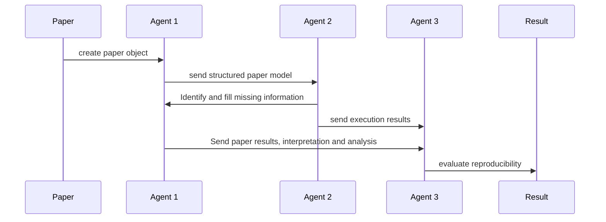

# Architecture

This ADR explains how the project uses Python and agents to structure reproducibility work as a sequence of object modeling, code generation/execution, and evaluation steps.

## ADR: Agent-driven reproducibility pipeline

We use Python to build an object-oriented representation of each paper, then apply a three-agent pipeline to support reproducibility research.

1. Agent 1: Paper representation and analysis
   - Task: parse the paper and create a structured object with metadata, claims, methods, artifacts, and evaluation targets.
   - General reproducibility subtasks:
     - identify the experimental scope and reproducibility goals
     - capture the paper’s stated dependencies, environment, and data requirements
     - record availability of documentation, code, and datasets
   - Dynamic paper-specific subtasks:
     - extract paper-specific environment details such as OS, framework versions, and hardware assumptions
     - catalogue any custom data sources, preprocessing steps, or external datasets mentioned
     - surface missing or ambiguous details that affect reproducibility

2. Agent 2: Code generation and execution
   - Task: generate and run implementation code based on the paper object created by Agent 1.
   - General reproducibility subtasks:
     - resolve dependencies and install required packages
     - create or validate the runtime environment for execution
     - execute the code path needed to reproduce reported results
   - Dynamic paper-specific subtasks:
     - assemble paper-specific scripts, model training or evaluation workflows, and data loading logic
     - handle custom dataset downloads, format conversions, and environment setup steps unique to the paper
     - adapt code to available resources and detect runtime failures caused by missing assumptions

3. Agent 3: Reproducibility evaluation
   - Task: evaluate whether the generated execution reproduces the paper’s claims.
   - General reproducibility subtasks:
     - compare outputs against reported metrics or expected behavior
     - validate the completeness of environment, data, and documentation coverage
     - classify reproducibility outcomes and surface gaps
   - Dynamic paper-specific subtasks:
     - assess whether the particular dataset, model settings, and evaluation procedure align with the paper
     - identify any paper-specific deviations from the original experiment
     - document results, limitations, and any unresolved reproducibility issues
