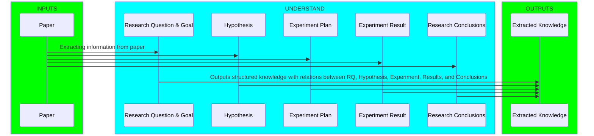
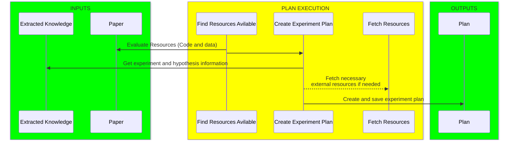
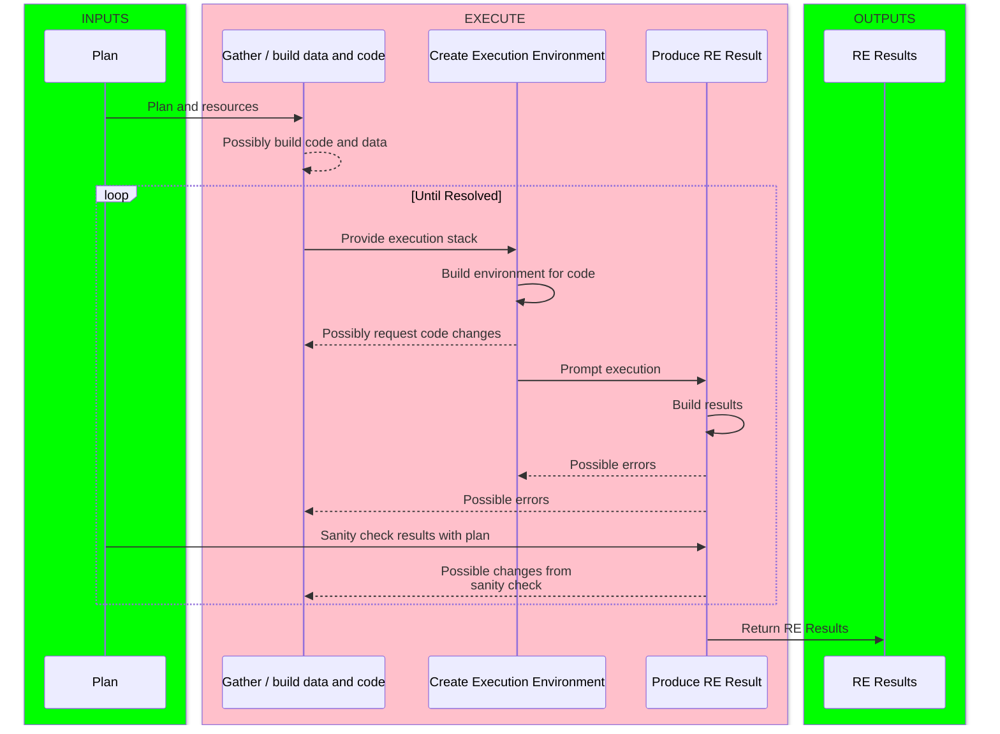
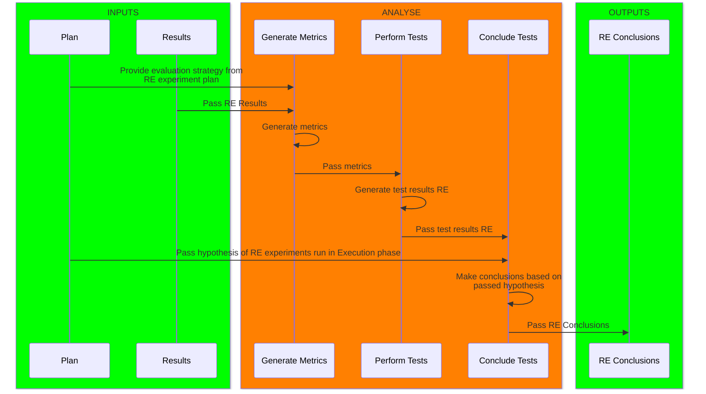
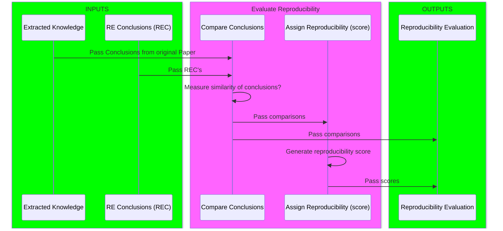
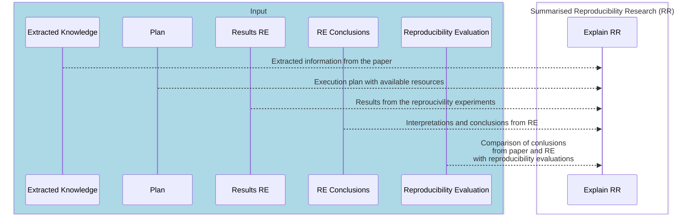

# Task decomposition of Reproducing Research and scoring reproducibility

This is an effort to decompose the main tasks of a reproducibility research paired with the overall goal of our research which is automated reproducibility. It adds the evaluation of reproducibility, essentially a measurement of reproducibility for research papers. To avoid confusion between the components of a paper and reproducibility experiemnt the components related with reproducibility experiment are marked with **RE**.

## Main tasks

We decompose the main tasks into the following:

1. **Understand** the research
2. **Plan** the execution of the reproducibility experiment
3. **Execute** the reproducibility experiment
4. **Analyze** the resilt from the reproducibility experiment
5. **Evaluate** the analysis and conclude reproducibility

it is also possible to add a 6th step

6. **Explain** the reproducibility evaluation and score

These tasks has their own sub tasks. The process is described in a sequence diagrams below.

### 1. Subtasks Understand

### 2. Subtasks Plan

### 3. Subtasks Execute

### 4. Subtasks Analyse

### 5. Subtasks Evaluate Reproducbility

### 6. Subtask Explain Reproducibility Evaluation and Score

